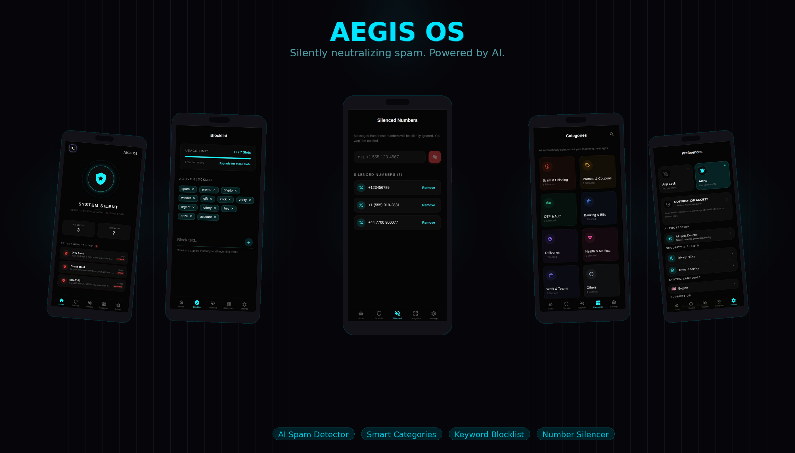
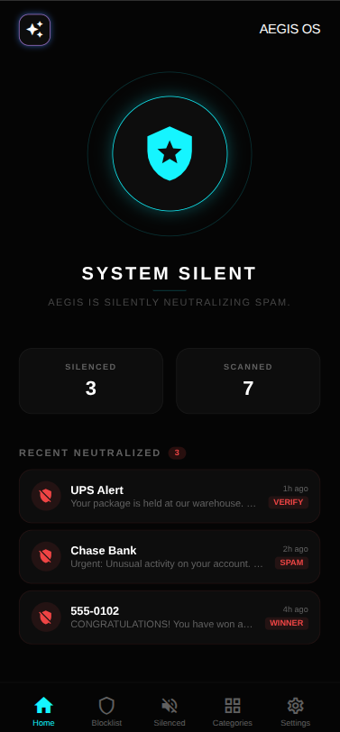
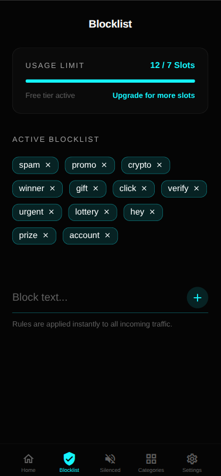
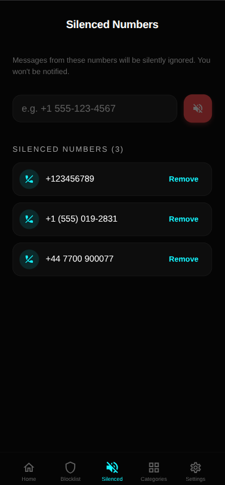
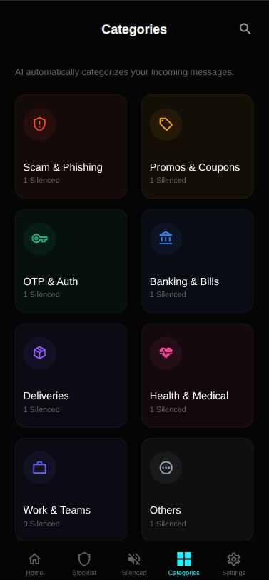
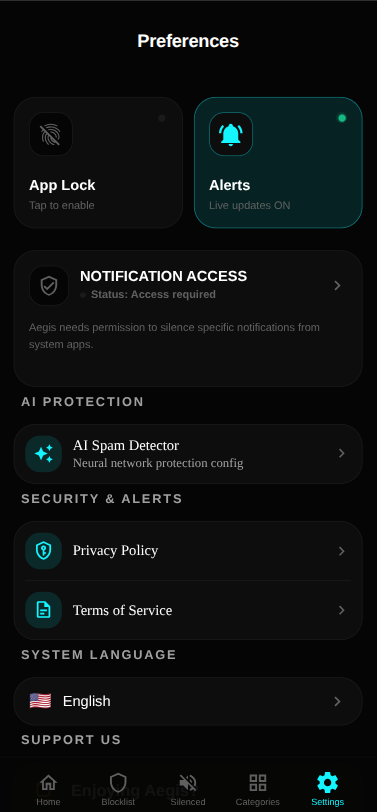

<div align="center">

# 🛡️ Aegis OS

**Silently neutralizing spam, scams, and unwanted calls — powered by AI.**


<!-- Replace the line below with your mockup image after generating it on shots.so -->


</div>

---

## Overview

Aegis OS is a smart spam and call protection app that silently filters unwanted messages and phone numbers in the background. It uses a neural network-based AI detector combined with a customizable keyword blocklist to identify and neutralize threats before they ever reach you.

No alerts. No noise. Just silence.

---

## Features

- **System Silent Mode** — Aegis runs quietly in the background, auto-silencing spam without interrupting you.
- **AI Spam Detector** — Neural network protection that classifies incoming messages across multiple threat categories.
- **Keyword Blocklist** — Add custom keywords to block messages containing specific words or phrases (e.g. `spam`, `winner`, `urgent`, `crypto`).
- **Silenced Numbers** — Permanently silence specific phone numbers so messages are ignored and you're never notified.
- **Smart Categories** — Incoming messages are automatically sorted into categories:
  - 🚨 Scam & Phishing
  - 🏷️ Promos & Coupons
  - 🔑 OTP & Auth
  - 🏦 Banking & Bills
  - 📦 Deliveries
  - 🏥 Health & Medical
  - 💼 Work & Teams
  - 💬 Others
- **Live Alerts** — Opt-in to real-time notifications for newly silenced items.
- **App Lock** — Protect Aegis settings behind biometric or PIN authentication.
- **Stats Dashboard** — See how many messages were silenced and scanned at a glance.

---

## Screenshots

| Home | Blocklist | Silenced Numbers | Categories | Settings |
|------|-----------|-----------------|------------|----------|
|  |  |  |  |  |

> 📸 Replace the image paths above with your actual screenshot files.

---

## How It Works

1. **Aegis monitors** all incoming SMS and call traffic in the background.
2. **The AI model** scans each message against its neural network to detect spam patterns.
3. **Keyword rules** are applied instantly — if a message contains any blocked keyword, it is silenced.
4. **Number blocklist** ensures repeat offenders are never heard from again.
5. **You stay notified** only about what matters.

---

## Getting Started

### Prerequisites

- Android 8.0+ or iOS 14+
- Notification Access permission (required to silence system notifications)

### Installation

```bash
# Clone the repository
git clone https://github.com/abdulrahmanJAlabbed/SpamKiller.git

# Navigate into the project directory
cd SpamKiller

# Install dependencies
npm install
# or
flutter pub get
```

### Running the App

```bash
# For development
npm run start
# or
flutter run
```

> **Note:** Grant Notification Access in your device settings when prompted. Without it, Aegis cannot silence incoming spam.

---

## Configuration

| Setting | Description |
|---|---|
| AI Spam Detector | Configure the neural network protection sensitivity |
| Blocklist | Add or remove keywords; up to 7 slots on the free tier |
| Silenced Numbers | Manually add phone numbers to silence permanently |
| Alerts | Toggle live update notifications on or off |
| App Lock | Enable biometric or PIN lock for the app |
| Language | Set system language (currently supports English) |

---

## Roadmap

- [ ] Cloud sync for blocklist and silenced numbers
- [ ] Expanded slot limits on premium tier
- [ ] Per-category silence/allow rules
- [ ] Scheduled silence windows
- [ ] Widget for home screen stats
- [ ] Multi-language support

---

## Privacy

Aegis OS processes all message scanning **on-device**. No message content is sent to external servers. The AI model runs locally to ensure your data stays private.

Read the full [Privacy Policy](./PRIVACY.md) and [Terms of Service](./TERMS.md) in the app settings or this repository.

---

## Contributing

Contributions are welcome! Please open an issue first to discuss what you'd like to change.

```bash
# Create a feature branch
git checkout -b feature/your-feature-name

# Commit your changes
git commit -m "feat: add your feature"

# Push and open a PR
git push origin feature/your-feature-name
```

---

## License

This project is licensed under the [MIT License](./LICENSE).

---

<div align="center">

Made with 🛡️ by the Aegis team · [Report a Bug](https://github.com/your-username/aegis-os/issues) · [Request a Feature](https://github.com/your-username/aegis-os/issues)

</div>
